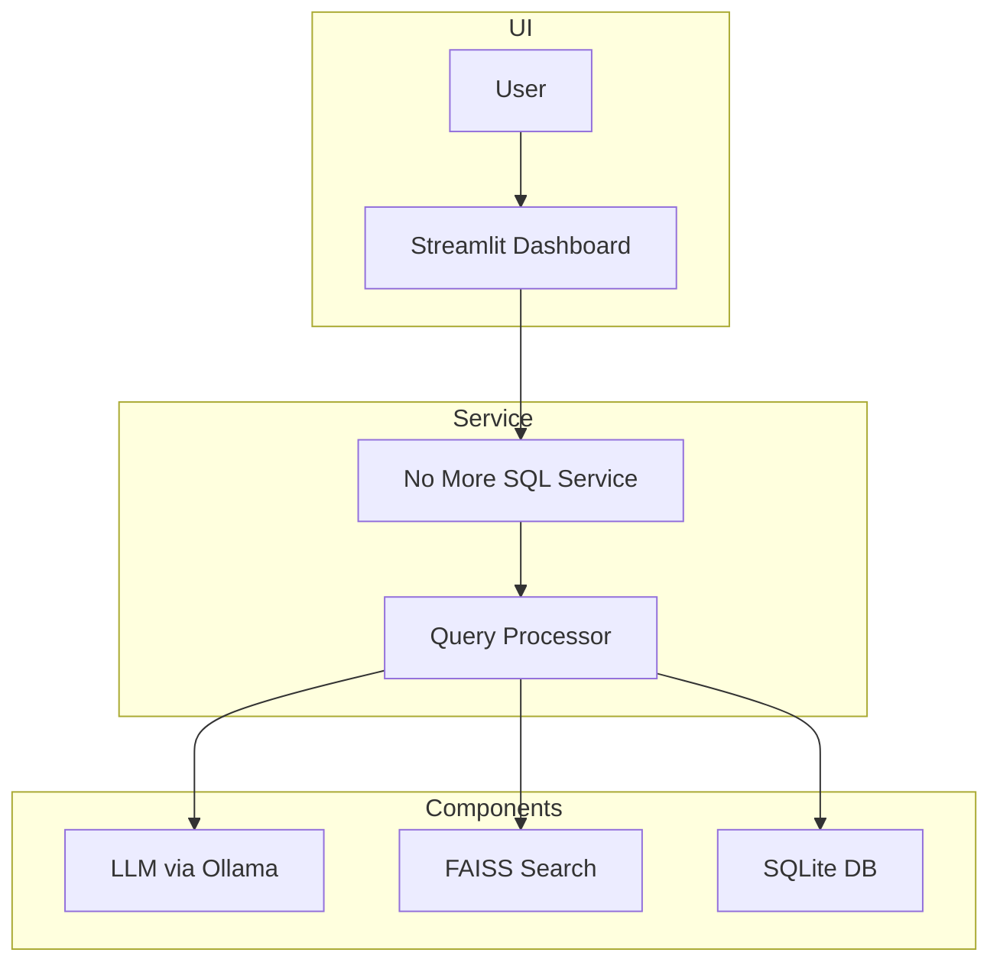

# No More SQL

Convert natural language to SQL queries using RAG-powered LLM.




## Quick Start

1. Start Ollama container:
```bash
docker run -d \
  --name ollama \
  --gpus all \
  --runtime=nvidia \
  -e NVIDIA_VISIBLE_DEVICES=all \
  -e NVIDIA_DRIVER_CAPABILITIES=all \
  -p 11434:11434 \
  -v ollama:/root/.ollama \
  ollama/ollama
```

2. Pull required model:
```bash
docker exec ollama ollama pull llama3.1:70b
```

3. Start the application:
```bash
sudo systemctl start no-more-sql
```

## System Architecture

### Components
- **LLM**: llama3.1:70b via Ollama
- **RAG**: FAISS for semantic search
- **Frontend**: Streamlit dashboard
- **Storage**: SQLite for feedback

### Access URLs
When running, the app is accessible at:
- Local: `http://localhost:8504`
- Network: `http://anlpa1.mskcc.org:8504`

## Development Setup

### Prerequisites
1. CUDA-capable GPU
2. Python 3.10
3. Docker with NVIDIA runtime
4. Create FAISS index on first run (will be generated from your data)

### Docker Configuration
1. Root directory: `/data/docker`
2. Models stored in: `/data/docker/volumes/ollama/_data/models/`
3. Current models:
   - llama3.1:70b (42GB)
   - deepseek-r1:1.5b (1.1GB)

### Service Management
```bash
# Start/Stop service
sudo systemctl start/stop no-more-sql

# View logs
sudo journalctl -u no-more-sql -f

# Restart after changes
sudo systemctl restart no-more-sql
```

## Making the App Accessible on a GPU Server

To make the Streamlit app accessible on a GPU server, you need to configure the server to listen on all network interfaces and adjust firewall settings to allow incoming traffic on the specified port.

### Server Configuration

1. **Run Streamlit with Network Access**: Use the following command to start the app, ensuring it listens on all network interfaces:

   ```bash
   streamlit run code/main.py --server.address=0.0.0.0 --server.port=8504
   ```

2. **Override Firewall Settings**: Use `iptables` to allow incoming traffic on the port the app is running on:

   ```bash
   sudo iptables -I INPUT -p tcp --dport 8504 -j ACCEPT
   ```

   This command inserts a rule to accept TCP traffic on port 8504, which is necessary if a firewall is blocking access by default.

## Troubleshooting

1. Check service status:
```bash
sudo systemctl status no-more-sql
```

2. Verify Ollama:
```bash
docker logs ollama
nvidia-smi  # Check GPU usage
```

3. Common issues:
   - Connection refused → Check if Ollama is running
   - Slow responses → Monitor GPU usage
   - Permission denied → Check service user and paths

## Important Paths
- Application: `/home/porwals/GitHub/projects/no-more-sql`
- Service config: `/etc/systemd/system/no-more-sql.service`
- Database: `data/feedback.db`
- FAISS index: `text_to_sql_index.faiss`

## Security Notes
- Service runs as user 'porwals'
- Port 8504 must be accessible
- Consider implementing authentication

## Deployment with Systemd

The "No More SQL" Streamlit app is deployed as a systemd service on the server. This allows the app to run as a background service, automatically start on boot, and be managed using standard systemd commands.

### Systemd Service File

The service file is located at `/etc/systemd/system/no-more-sql.service`. Below is the configuration used:

```ini
[Unit]
Description=No More SQL Streamlit App
After=network.target

[Service]
User=porwals
WorkingDirectory=/home/porwals/GitHub/projects/no-more-sql
Environment="PATH=/home/porwals/GitHub/projects/no-more-sql/.venv/bin:/usr/local/bin:/usr/bin:/bin"
ExecStart=/home/porwals/GitHub/projects/no-more-sql/.venv/bin/streamlit run code/main.py --server.port=8504 --server.address=0.0.0.0

Restart=always
RestartSec=5

[Install]
WantedBy=multi-user.target
```

## System Service Management

### View Deployed Services

1. **List All Services**: View all systemd services on the system:
   ```bash
   systemctl list-units --type=service
   ```

2. **List Running Services**: Show only active services:
   ```bash
   systemctl list-units --type=service --state=running
   ```

3. **View Service Status**: Check status of a specific service:
   ```bash
   systemctl status no-more-sql
   ```

### Deploying a New Service

1. **Create Service File**: Create a new systemd service file in `/etc/systemd/system/`:
   ```bash
   sudo nano /etc/systemd/system/your-app-name.service
   ```

2. **Service File Template**:
   ```ini
   [Unit]
   Description=Your App Description
   After=network.target

   [Service]
   User=your_username
   WorkingDirectory=/path/to/your/app
   Environment="PATH=/path/to/your/virtualenv/bin:/usr/local/bin:/usr/bin:/bin"
   ExecStart=/path/to/your/virtualenv/bin/streamlit run code/main.py --server.port=XXXX --server.address=0.0.0.0

   Restart=always
   RestartSec=5

   [Install]
   WantedBy=multi-user.target
   ```

3. **Enable and Start Service**:
   ```bash
   sudo systemctl daemon-reload          # Reload systemd manager configuration
   sudo systemctl enable your-app-name   # Enable service to start on boot
   sudo systemctl start your-app-name    # Start the service
   ```

4. **Configure Network Access**:
   ```bash
   sudo iptables -I INPUT -p tcp --dport XXXX -j ACCEPT  # Allow traffic on your port
   ```

### Common Service Management Commands

```bash
# Basic service control
sudo systemctl start service-name    # Start a service
sudo systemctl stop service-name     # Stop a service
sudo systemctl restart service-name  # Restart a service
sudo systemctl status service-name   # Check service status

# Service configuration
sudo systemctl enable service-name   # Enable service on boot
sudo systemctl disable service-name  # Disable service on boot

# Log viewing
sudo journalctl -u service-name -f   # View and follow service logs
```

Note: Replace `your-app-name`, `your_username`, and `XXXX` with your specific values when deploying a new service.